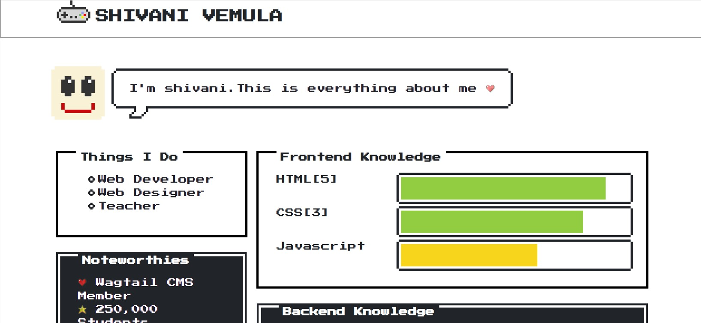
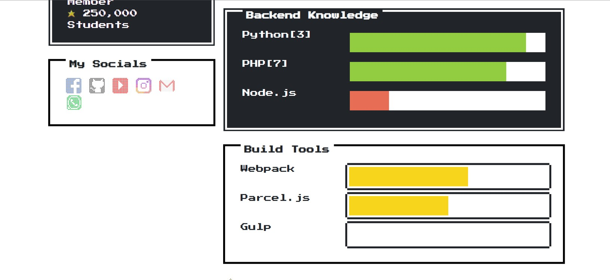
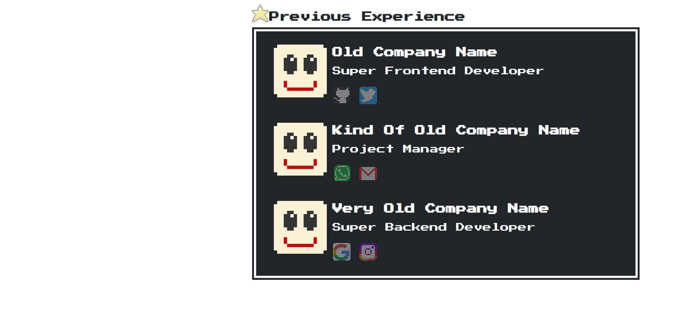

# 8bit-website

Overview
Welcome to the 8-Bit Website repository! This project contains an HTML website template designed to evoke the nostalgia and charm of classic 8-bit video games and computing. Crafted using HTML, CSS, and images, this website offers a retro-inspired browsing experience for visitors.

Features
Retro Design: The 8-bit website features a retro design reminiscent of classic video games and computing from the 1980s and 1990s.
Pixel Art: Embrace the pixel art aesthetic with custom-designed graphics, sprites, backgrounds, and icons to enhance the nostalgic feel of the website.
Custom Styling: CSS is used to style the website, ensuring a visually appealing and cohesive design that captures the essence of the 8-bit era.
Responsive Layout: The website is designed to be responsive, ensuring optimal viewing and functionality across various devices and screen sizes.
Image Assets: The repository includes image assets used for enhancing the visual appeal of the 8-bit website, such as pixel art graphics, backgrounds, and icons.

Usage
Clone the repository to your local machine.
Open the 8bit.html file in a web browser to view the 8-bit website.
Customize the page layout, styling, and content in the HTML and CSS files to match your desired theme or concept.
Replace the placeholder images with your desired pixel art graphics, backgrounds, icons, and other visuals to personalize the 8-bit website.
Test the website thoroughly to ensure functionality, usability, and compatibility across different browsers and devices.
Launch the 8-bit website and share it with friends, colleagues, or fellow enthusiasts to spread the nostalgia and appreciation for retro gaming and computing.

